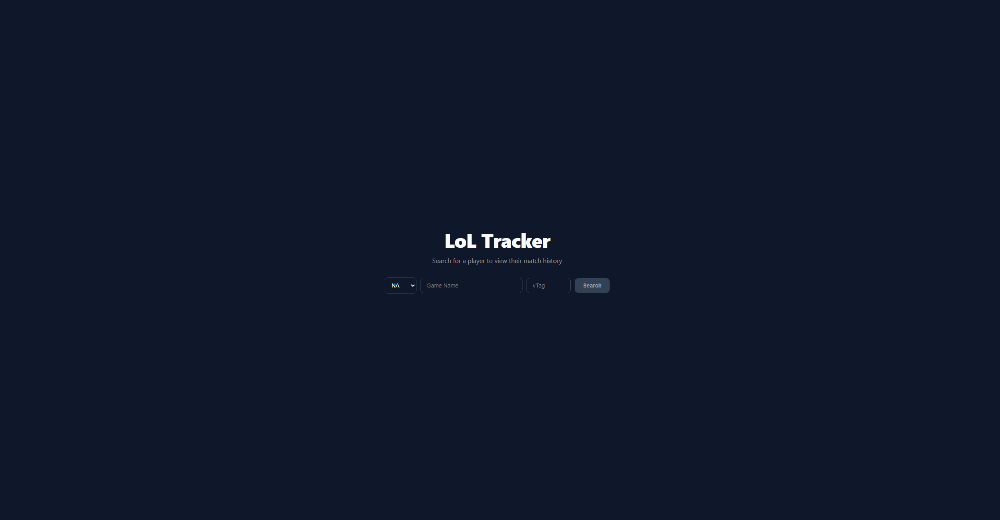
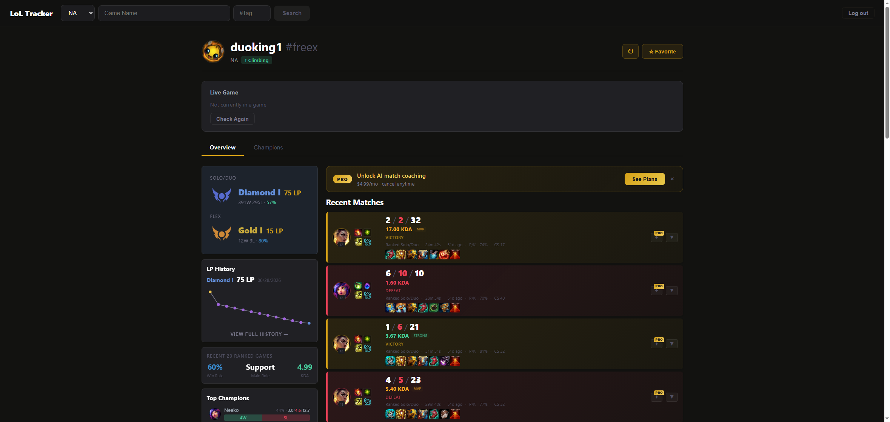
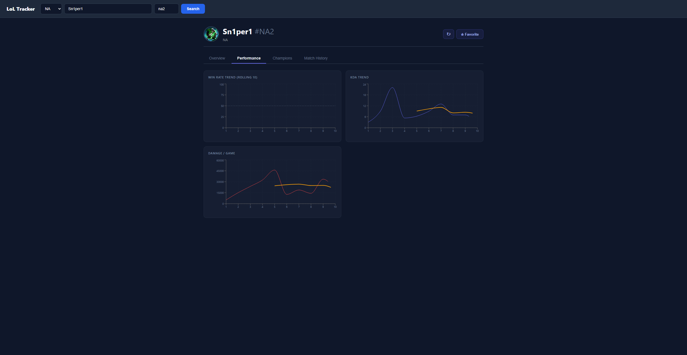
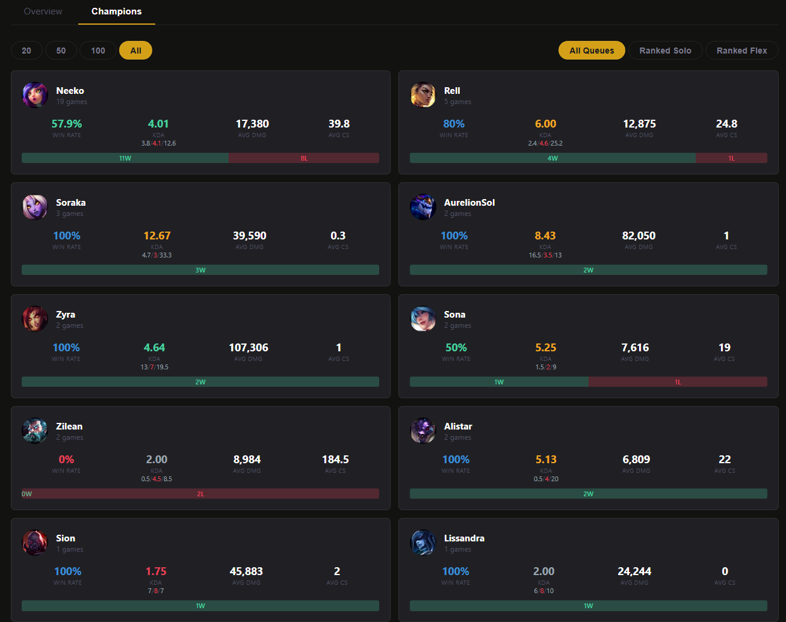
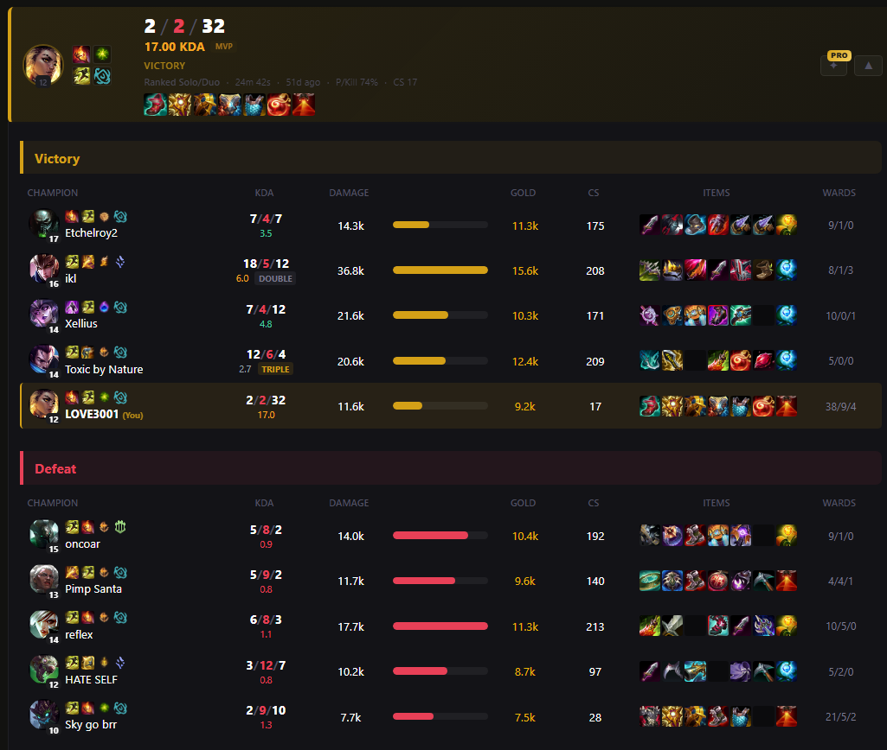
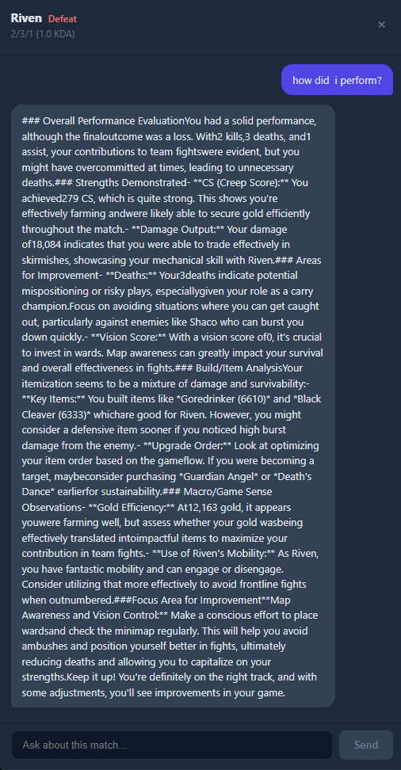
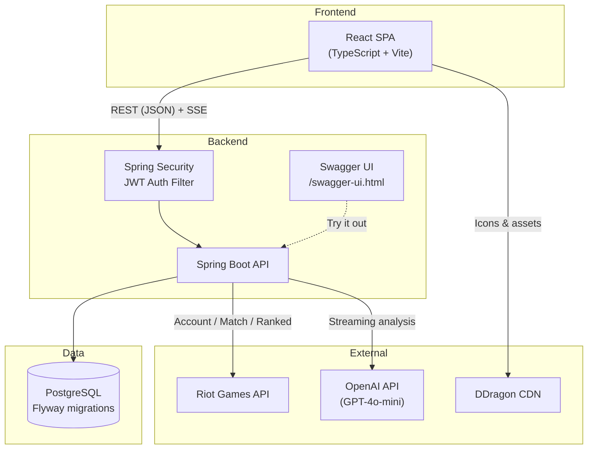

# LoL Tracker


[](https://codecov.io/gh/jianweicheng0822/lol-tracker)

Full-stack League of Legends analytics dashboard with AI-powered match coaching. Search any player by Riot ID, explore ranked stats, match history, champion performance, and LP trends — all in a dark-themed UI with real-time AI analysis.

## Demo

**Live Demo:** [http://3.84.122.22](http://3.84.122.22)

## Screenshots

| Home | Overview |
|------|----------|
|  |  |

| Performance | Champions |
|-------------|-----------|
|  |  |

| Match History | AI Analysis |
|---------------|-------------|
|  |  |

## Features

**Player Dashboard** — Tabbed profile (Overview, Performance, Champions, Match History) with URL-driven navigation, ranked badges, and persistent favorites

**Match History** — Match cards with champion icons, KDA, items, runes, and summoner spells. Expandable inline scoreboards with full 10-player stats. Arena mode support with augment icons. Cross-navigation between player profiles

**Performance Analytics** — LP progression chart, rolling win rate trend, KDA and damage trends with moving average overlays, per-champion stats grid

**AI Match Analysis** — Click the sparkle button on any match to open a chat modal. Streaming responses via SSE for real-time coaching. System prompt constructed server-side from structured match data

**JWT Authentication** — Stateless authentication with Bearer tokens. Register/login endpoints return JWTs. Anonymous access is preserved as FREE tier

**Subscription Tiers** — FREE/PRO system using JWT identity. FREE users get 20 matches and 5 requests/minute rate limiting. PRO users get 100 matches, unlimited requests, and AI analysis access

## Architecture



## Tech Stack

### Backend
| Technology | Purpose |
|------------|---------|
| Java 21 / Spring Boot | Web framework and REST API |
| Spring Security + JWT | Stateless authentication (jjwt) |
| Spring Data JPA | Database access (repositories) |
| PostgreSQL | Production relational database |
| Flyway | Database schema migrations |
| Spring WebFlux | WebClient for OpenAI streaming |
| Springdoc OpenAPI | Swagger UI + API documentation |
| Testcontainers | Integration tests with real PostgreSQL |
| JaCoCo | Code coverage enforcement (70% minimum) |

### Frontend
| Technology | Purpose |
|------------|---------|
| React / TypeScript | UI framework with type safety |
| Vite | Dev server and bundler |
| React Router | Client-side routing |
| Recharts | Trend charts |

### External APIs
- **[Riot Games API](https://developer.riotgames.com)** — Account, match, ranked, and summoner data
- **[OpenAI API](https://platform.openai.com)** — GPT-4o-mini for AI match analysis
- **[DDragon CDN](https://ddragon.leagueoflegends.com)** — Champion, item, spell, and profile icons
- **[Community Dragon](https://communitydragon.org)** — Ranked tier icons, Arena augment icons

## Quick Start (Docker Compose)

```bash
# 1. Clone and configure
git clone https://github.com/jianweicheng0822/lol-tracker.git
cd lol-tracker
cp .env.example .env   # Edit .env with your API keys

# 2. Start PostgreSQL + app
docker compose up --build

# 3. Open the app and API docs
#    App:     http://localhost:8080
#    Swagger: http://localhost:8080/swagger-ui.html
```

## Manual Setup

### Prerequisites
- Java 21+
- Node.js 18+
- PostgreSQL 16+
- [Riot API Key](https://developer.riotgames.com)
- [OpenAI API Key](https://platform.openai.com/api-keys)

### Environment Variables

Create a `backend/.env` file (or set env vars):

| Variable | Required | Default | Description |
|----------|----------|---------|-------------|
| `RIOT_API_KEY` | Yes | — | Riot Games API key |
| `OPENAI_API_KEY` | Yes | — | OpenAI API key for AI analysis |
| `JWT_SECRET` | Yes | dev default | Secret for signing JWTs (min 32 chars) |
| `DB_HOST` | No | `localhost` | PostgreSQL host |
| `DB_PORT` | No | `5432` | PostgreSQL port |
| `DB_NAME` | No | `lol_tracker` | PostgreSQL database name |
| `DB_USER` | No | `postgres` | PostgreSQL username |
| `DB_PASSWORD` | No | `postgres` | PostgreSQL password |
| `CORS_ORIGIN` | No | `http://localhost:5173` | Allowed CORS origin |

### Running Locally

```bash
# Start PostgreSQL (via Docker or local install)
docker run -d --name lol-pg -p 5432:5432 \
  -e POSTGRES_DB=lol_tracker -e POSTGRES_PASSWORD=postgres \
  postgres:16-alpine

# Backend — starts at http://localhost:8080
cd backend
./mvnw spring-boot:run

# Frontend — starts at http://localhost:5173 (proxies API to backend)
cd frontend
npm install
npm run dev
```

## API Documentation

Interactive Swagger UI is available at `/swagger-ui.html` when the app is running.

### Endpoints

| Domain | Method | Endpoint | Description |
|--------|--------|----------|-------------|
| Auth | POST | `/api/auth/register` | Register new user, returns JWT |
| | POST | `/api/auth/login` | Login, returns JWT |
| Summoner | GET | `/api/summoner` | Resolve Riot ID to account |
| Matches | GET | `/api/matches/recent` | Recent match IDs |
| | GET | `/api/matches/summary` | Match summaries with KDA and rosters |
| | GET | `/api/matches/detail` | Raw match detail from Riot API |
| | GET | `/api/matches/full-detail` | Parsed match detail with all participants |
| Stats | GET | `/api/stats` | Aggregated player statistics |
| Ranked | GET | `/api/ranked` | Ranked entries (Solo/Duo, Flex) |
| Favorites | GET | `/api/favorites` | List all favorites |
| | POST | `/api/favorites` | Add a player to favorites |
| | DELETE | `/api/favorites/{puuid}` | Remove a favorite |
| | GET | `/api/favorites/check/{puuid}` | Check if player is favorited |
| Trends | GET | `/api/trends/champions` | Per-champion aggregated stats |
| | GET | `/api/trends/matches` | Per-match trend data points |
| | GET | `/api/trends/lp` | LP progression history |
| AI | POST | `/api/analyze` | AI match analysis (sync, PRO only) |
| | POST | `/api/analyze/stream` | AI match analysis (SSE streaming, PRO only) |
| Subscription | GET | `/api/tier` | Get current user's subscription tier |
| | GET | `/api/upgrade` | Upgrade current user to PRO |
| Health | GET | `/health` | Health check |

## Testing

```bash
cd backend

# Unit tests only (H2 in-memory, no Docker needed)
./mvnw test

# Unit + integration tests (requires Docker for Testcontainers)
./mvnw verify
```

| Suite | Count | Database | Docker required |
|-------|-------|----------|-----------------|
| Unit tests | 158 | H2 in-memory | No |
| Integration tests | 12 | PostgreSQL (Testcontainers) | Yes |

Unit tests use H2 with `ddl-auto=create-drop` and Flyway disabled. Integration tests use Testcontainers to spin up a real PostgreSQL container and run Flyway migrations, validating the full stack end-to-end.

## Database

PostgreSQL with Flyway-managed migrations:

| Migration | Description |
|-----------|-------------|
| `V1__init_schema.sql` | Initial schema: `app_users`, `favorite_players`, `match_records`, `lp_snapshots` |
| `V2__add_auth_fields.sql` | Adds `username` and `password` columns to `app_users` |

Schema is validated at startup (`ddl-auto=validate`) — Flyway is the single source of truth for DDL.

## Production Deployment

### Docker

```bash
docker build -t lol-tracker .

docker run -p 8080:8080 \
  -e RIOT_API_KEY=your-key \
  -e OPENAI_API_KEY=your-key \
  -e JWT_SECRET=your-secret \
  -e DB_HOST=your-db-host \
  -e DB_NAME=lol_tracker \
  -e DB_USER=postgres \
  -e DB_PASSWORD=your-password \
  lol-tracker
```

### AWS EC2

Automated via GitHub Actions (`.github/workflows/ci-cd.yml`):
- **On PR to `master`** — runs lint, build, and tests
- **On push to `master`** — builds Docker image, pushes to GHCR, deploys to EC2 via SSH

Production requires a PostgreSQL instance (Docker container on EC2 or RDS).

## Project Structure

```
lol-tracker/
├── docker-compose.yml          # Local dev: PostgreSQL + app
├── .env.example                # Env var template
├── Dockerfile                  # Multi-stage build
├── backend/
│   ├── src/main/java/com/jw/backend/
│   │   ├── *Controller.java    # REST endpoints (Javadoc on all public methods)
│   │   ├── security/           # JWT filter, SecurityConfig, JwtUtil
│   │   ├── config/             # OpenApiConfig (Swagger/OpenAPI)
│   │   ├── service/            # Business logic layer
│   │   ├── repository/         # Spring Data JPA interfaces
│   │   ├── entity/             # JPA entities (AppUser, MatchRecord, etc.)
│   │   ├── dto/                # Immutable records for API transport
│   │   ├── region/             # Riot region routing/platform mappings
│   │   └── exception/          # Global exception handler + custom exceptions
│   ├── src/main/resources/
│   │   ├── application.properties
│   │   └── db/migration/       # Flyway SQL migrations
│   └── src/test/
│       ├── java/.../integration/  # Testcontainers integration tests
│       └── resources/             # H2 test config
└── frontend/
    └── src/
        ├── api.ts              # JWT token management + API client
        ├── types.ts            # Shared TypeScript interfaces
        ├── hooks/              # Custom React hooks (useTabNavigation)
        ├── utils/              # DDragon helpers, LP conversion, trend math
        ├── components/         # Reusable UI components (JSDoc documented)
        └── pages/              # Route-level page components
```

## Code Documentation

All source files follow a consistent documentation standard:

- **Backend (Java):** Javadoc with `@file`, `@description`, `@module` headers. All public methods have `@param`, `@returns`, and `@throws` annotations where applicable.
- **Frontend (TypeScript):** JSDoc with the same file header convention. Exported functions and components include parameter and return descriptions.
- **Style:** Imperative mood, concise descriptions focused on intent and business logic rather than restating code.

## License

This project is for educational purposes.

---

Built with the [Riot Games API](https://developer.riotgames.com) and [OpenAI API](https://platform.openai.com)
